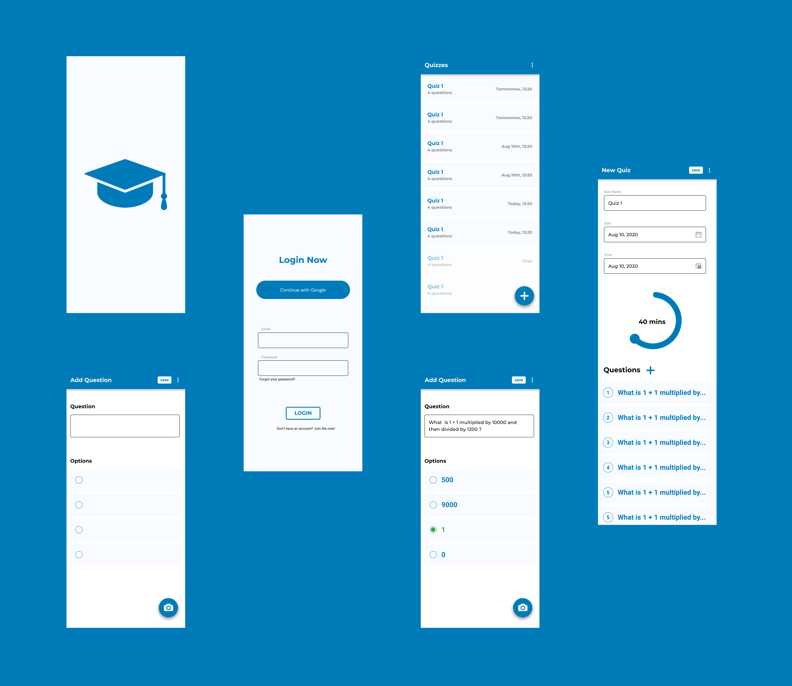

<h1 align="center"> Quizzie App Companion (Android)</h1>

<p align="center"> 
	Android client for <a href="https://github.com/Quizzie-SE">Quizzie</a>
</p>

&nbsp;&nbsp;&nbsp; [](https://github.com/Quizzie-SE/Quizzie-Android-Companion/actions) &nbsp;&nbsp;&nbsp;[](https://github.com/ACM-VIT/ACM-internals-Android/blob/main/LICENSE) &nbsp;&nbsp;&nbsp; [](https://www.figma.com/file/DVmaGUkqTTvJ2VQEaDfJGK/Quizzie-Android?node-id=0%3A1)

# Quizzie

This project is a complete online quiz management platform with a plethora of features for teachers and students. It provides all the basic functionalities of a quiz portal like timer, scoring, ranking etc. alongside analysis of results from the students on the teacher dashboard, summary of tests for the student, Login and signup using a Google account for both teacher and student. It provides a smooth user interface for both the teachers and students to create and attempt different kinds of quizzes seamlessly. 
<br><br>
Quizzie Android app allows as an extension to the organizer's side of the website to allow them to add questions by capturing it from a book or elsewhere just to make the process of adding questions simpler for teachers

---
[](https://documenter.getpostman.com/view/10968840/SzzoZF12)


## Motivation
  The motivation of this project came from the idea to help teachers and institute administrators create quizzes and tests in an efficient manner. With the popularity of the Internet, it is inevitable to have online quizzes as classroom assessments. In learning, online quizzes may serve two objectives, that is, for self-study or as a formal assessment. The online quiz has its advantages, such as saving the cost of paper printing and reducing the time spent for having assessments in class. However, there are weaknesses. Its primary drawback is the issue of academic dishonesty, especially when students are answering online quiz.


### [Android APK - Open this link in the Android device to install the app](https://drive.google.com/file/d/1xkUSU42fkIFWYrAX0bFsM6yKXx7bJ1--/view?usp=sharing)


## Screenshots


## How is the app built?
This app is coded natively using MVVM(Model View - View Model) architecture in Kotlin. It is built in Android Studio.

## Structure

* `build.gradle` - root gradle config file
* `settings.gradle` - root gradle settings file
* `app` - our only project in this repo
* `app/build.gradle` - project gradle config file
* `app/src` - main project source directory
* `app/src/main` - main project flavour
* `app/src/main/AndroidManifest.xml` - manifest file
* `app/src/main/java` - java source directory
* `app/src/main/res` - resources directory

## Features

* An organizer can create a quiz, add questions to it and publish them
* Organizer can add questions from a book by capturing it from the Android device
* The text recognition module automatically captures the text from the image
* There is no capture button to capture the image. It automatically captures after the text is recognized
* The question can be edited anytime and the changes to the text can be entered manually as well.
* The quiz after it is saved is made available for the students to attend from the website.

## Execution

* This github repositority can be cloned using "git clone <github_link>" command
* Android Studio has to be installed (Version > 4.0)
* The cloned repo in the local PC should be opened using Android Studio
* Follow the unpacking instructions below to execute the build and run the app

## Unpacking

This repository uses secrets that aren't pushed to the version control. However they are needed to build the project. Follow the below steps to obtain the files.

From the project root, execute:

```
.github/encrypted_secrets/decrypt_secrets.sh SECRET_KEY
```

If you are not on the development team contact us at amit.ananthkumar@gmail.com to obtain the SECRET_KEY used to unlock the secrets.

## Building

It is recommended that you run Gradle with the `--daemon` option, as starting
up the tool from scratch often takes at least a few seconds. You can kill the
java process that it leaves running once you are done running your commands.

Tasks work much like Make targets, so you may concatenate them. Tasks are not
re-done if multiple targets in a single command require them. For example,
running `assemble install` will not compile the apk twice even though
`install` depends on `assemble`.

#### Clean

	gradle clean

#### Debug

This compiles a debugging apk in `build/outputs/apk/` signed with a debug key,
ready to be installed for testing purposes.

	gradle assembleDebug

You can also install it on your attached device:

	gradle installDebug

#### Release

This compiles an unsigned release (non-debugging) apk in `build/outputs/apk/`.
It's not signed, you must sign it before it can be installed by any users.

	gradle assembleRelease

#### Test

Were you to add automated java tests, you could configure them in your
`build.gradle` file and run them within gradle as well.

	gradle test

#### Lint

This analyses the code and produces reports containing warnings about your
application in `build/outputs/lint/`.

	gradle lint

## Contributors
<table>
<tr align="center">

<td>
Amit Krishna A
<p align="center">

</p>
<p align="center">
<a href = "https://github.com/akri16"></a>
<a href = "https://www.linkedin.com/in/akri16/">

</a>
</p>
</td>

<td>
Dinesh B S
<p align="center">

</p>
<p align="center">
<a href = "https://github.com/DineshBS44"></a>
<a href = "https://www.linkedin.com/in/dinesh-b-s-197983192/">

</a>
</p>
</td>

</tr>
  </table>


## Further reading

* [Build System Overview](https://developer.android.com/sdk/installing/studio-build.html)
* [Gradle Plugin User Guide](http://tools.android.com/tech-docs/new-build-system/user-guide)
* [Gradle Plugin Release Notes](http://tools.android.com/tech-docs/new-build-system)
